# 🍭🚀💗 Animation Tutorials

[](https://androidweekly.net/issues/issue-437)
[](https://kotlinlang.org)
[](https://android-arsenal.com/api?level=21)

Tutorials about animations in Android such as ObjectAnimators, ValueAnimators, translations,
gradient animations, AnimationDrawables, AnimatedVectorDrawables with states, physics animations,
fragment transitions, image to ViewPager transitions and more.

## Overview

* [Tutorial1-1Basics](https://github.com/SmartToolFactory/Animation-Tutorials/tree/master/Tutorial1-1Basics)
<br>Tutorials about animators, animation basics and using coroutine based SurfaceView to create a counter up down motion

| Ch2-3 Circular Reveal      | Ch2-4 Rotate X/Y Flip   | Ch2-6 Zoom |
| ----------|-----------| -----------|
| 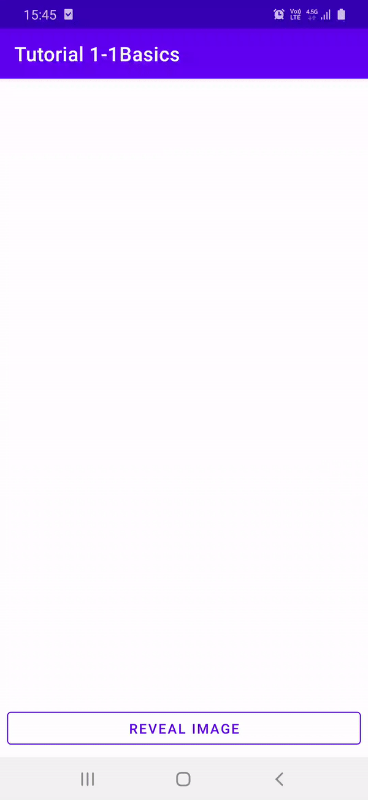 |  | 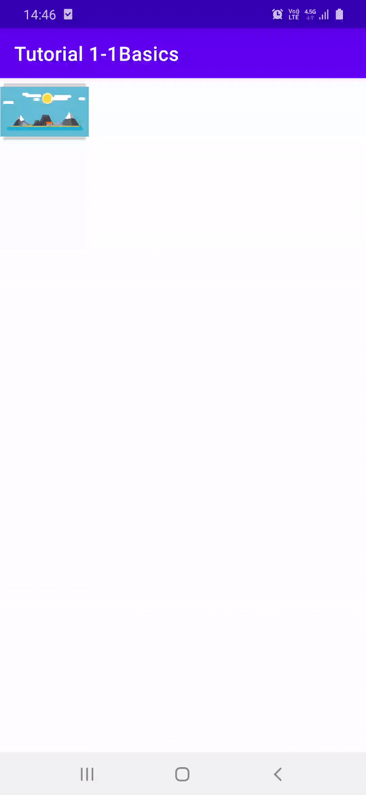 |

| Ch2-7 Gradient | Ch2-8 Counter TextViews   | Ch2-9 Counter SurfaceView |
| ----------|----------------| --------|
|  |  | 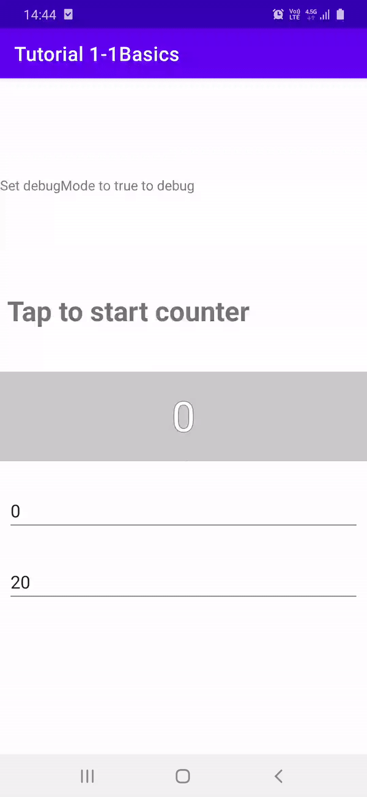 |

| Ch3-1 Physics | Ch3-2 Scale and Chained   | Ch3-3 Fling | Ch3-4 BNV+TabLayout Physics|
| ----------|----------------| --------| --------|
| 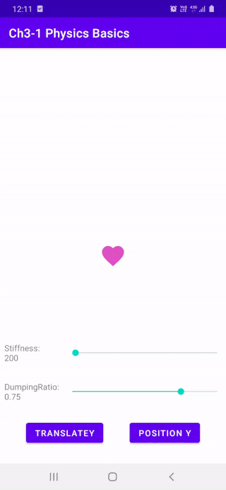 | 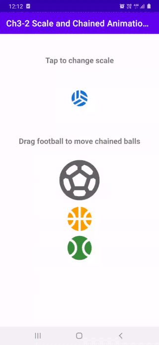 |  | 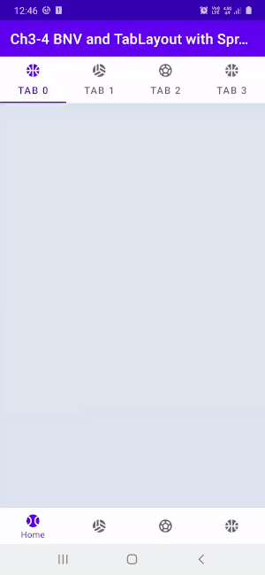 |

<br>

* [Tutorial2-1Animated Vector Drawables](https://github.com/SmartToolFactory/Animation-Tutorials/tree/master/Tutorial2-1AnimatedVectorDrawables)
<br>Tutorials about Vector drawables, AnimatedVectorDrawables, and animation transitions for Animated Drawables

| Ch1-1 Animated VDs | Ch1-2 State Change   | Ch1-3 BNV Icons |
| ----------|----------------| --------|
| 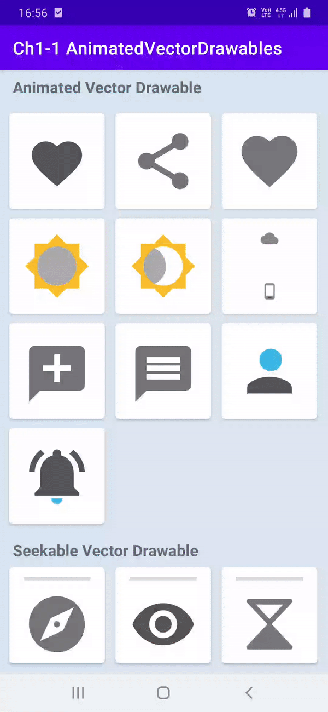 | 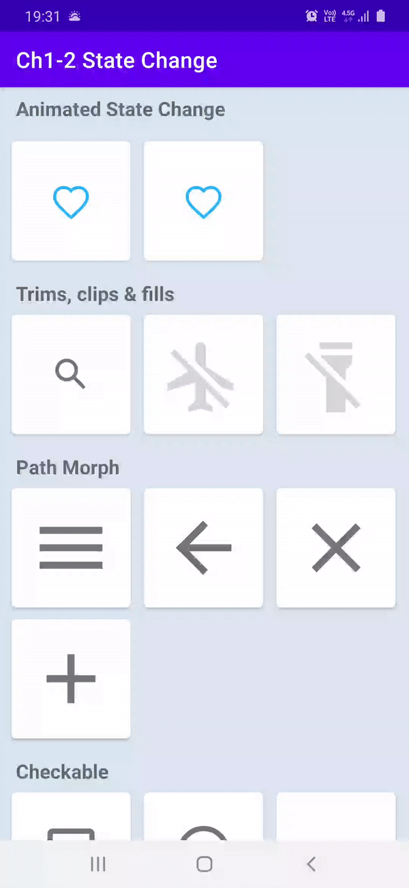 | 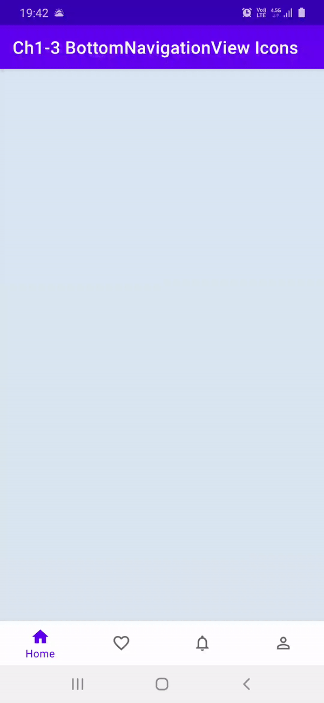 |

* [Tutorial3-1Shared Transitions](https://github.com/SmartToolFactory/Animation-Tutorials/tree/master/Tutorial3-1Transitions)
Tutorials about Shared Transitions from Activity to Activity, and from Fragment to Fragment

| Ch1-2 RV Transition | Ch1-4 RV to VP2 Transition   | Ch2-3 Nav Components |
| ----------|----------------| --------|
| 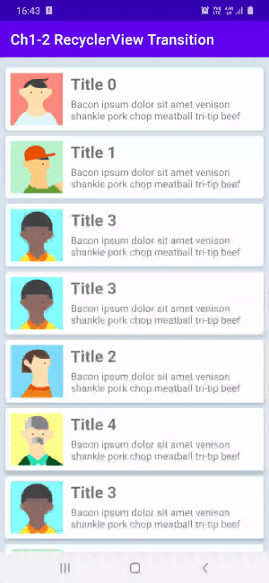 |  |  |


## Physics Based Animations
Physics-based motion is driven by force. Spring force is one such force that guides interactivity and motion. A spring force has the following properties: damping and stiffness. In a spring-based animation, the value and the velocity are calculated based on the spring force that are applied on each frame.

If you'd like your app's animations to slow down in only one direction, consider using a friction-based fling animation instead.

### Build a spring animation
The general steps for building a spring animation for your application are as follows:

* Add the support library You must add the support library to your project to use the spring animation classes.
* Create a spring animation: The primary step is to create an instance of the SpringAnimation class and set the motion behavior parameters.
* (Optional) Register listeners: Register listeners to watch for animation lifecycle changes and animation value updates.

**Note:** Update listener should be registered only if you need per-frame update on the animation value changes. An update listener prevents the animation from potentially running on a separate thread.

* (Optional) Remove listeners: Remove listeners that are no longer in use.
* (Optional) Set a start value: Customize the animation start value.
* (Optional) Set a value range: Set the animation value range to restrain values within the minimum and the maximum range.
* (Optional) Set start velocity: Set the start velocity for the animation.
* (Optional) Set spring properties: Set the damping ratio and the stiffness on the spring.
* (Optional) Create a custom spring: Create a custom spring in case you do not intend to use the default spring or want to use a common spring throughout the animation.
* Start animation: Start the spring animation.
* (Optional) Cancel animation: Cancel the animation in case the user abruptly exits the app or the view becomes invisble.

## Drawable Animations   

### XML for the VectorDrawable containing properties to be animated
A VectorDrawable can be represented in xml with

```
<vector xmlns:android="http://schemas.android.com/apk/res/android"
      android:height="64dp"
      android:width="64dp"
      android:viewportHeight="600"
      android:viewportWidth="600" >
      <group
          android:name="rotationGroup"
          android:pivotX="300.0"
          android:pivotY="300.0"
          android:rotation="45.0" >
          <path
              android:name="v"
              android:fillColor="#000000"
              android:pathData="M300,70 l 0,-70 70,70 0,0 -70,70z" />
      </group>
  </vector>
```

where width and height are the actual dimensions of while viewportWidth, and viewportHeight are used for drawing coordinates.

**M**(x,y) 	Begin a new subpath by moving to (x,y).

**L**(x,y) Draw a line to (x,y).

**C** (x1,y1 x2,y2 x,y) Draw a cubic bezier curve to (x,y) using control points (x1,y1) and (x2,y2).

**Z** Close the path by drawing a line back to the beginning of the current subpath

**group** tag is used for grouping sections of drawable to be able to be animated together. And some animations such as
rotation, and translation can only be applied to groups.

Animations can be performed on the animatable attributes in android.graphics.drawable.VectorDrawable. 
These attributes will be animated by android.animation.ObjectAnimator. 
The ObjectAnimator's target can be the root element, a group element or a path element.
 The targeted elements need to be named uniquely within the same VectorDrawable. 
 Elements without animation do not need to be named.
 
 For more details you can check out [here](https://www.androiddesignpatterns.com/2016/11/introduction-to-icon-animation-techniques.html)

### XML for AnimatedVectorDrawable

An AnimatedVectorDrawable element has a VectorDrawable attribute, and one or more target element(s). 
The target element can specify its target by android:name attribute, 
and link the target with the proper ObjectAnimator or AnimatorSet by android:animation attribute.

🔥😍 [ShapeShifter](https://shapeshifter.design) by **Alex Lockwood** makes it so easy to create animations for Vector Drawables.
Wonderful and very easy to use tool to create Animated Vector Drawables.

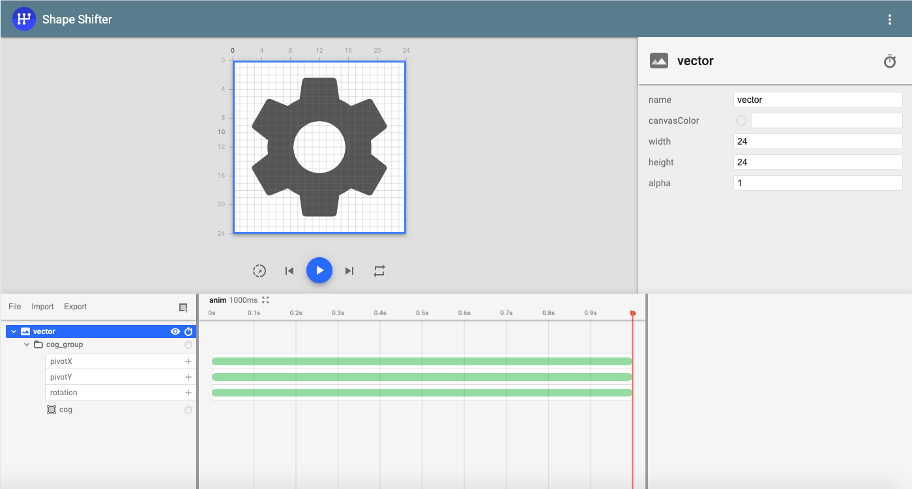 

### XML for Animations defined using ObjectAnimator or AnimatorSet
```
<set xmlns:android="http://schemas.android.com/apk/res/android">
      <objectAnimator
          android:duration="3000"
          android:propertyName="pathData"
          android:valueFrom="M300,70 l 0,-70 70,70 0,0 -70,70z"
          android:valueTo="M300,70 l 0,-70 70,0  0,140 -70,0 z"
          android:valueType="pathType"/>
</set>
```
### Define an AnimatedVectorDrawable all in one XML file

Since the AAPT tool supports a new format that bundles several related XML files together, we can merge the XML files from the previous examples into one XML file:

```
<animated-vector xmlns:android="http://schemas.android.com/apk/res/android"
                   xmlns:aapt=&quothttp://schemas.android.com/aapt" >
      <aapt:attr name="android:drawable">
          <vector
              android:height="64dp"
              android:width="64dp"
              android:viewportHeight="600"
              android:viewportWidth="600" >
              <group
                  android:name="rotationGroup"
                  android:pivotX="300.0"
                  android:pivotY="300.0"
                  android:rotation="45.0" >
                  <path
                      android:name="v"
                      android:fillColor="#000000"
                      android:pathData="M300,70 l 0,-70 70,70 0,0 -70,70z" />
              </group>
          </vector>
      </aapt:attr>
 
      <target android:name="rotationGroup"> *
          <aapt:attr name="android:animation">
              <objectAnimator
              android:duration="6000"
              android:propertyName="rotation"
              android:valueFrom="0"
              android:valueTo="360" />
          </aapt:attr>
      </target>
 
      <target android:name="v" >
          <aapt:attr name="android:animation">
              <set>
                  <objectAnimator
                      android:duration="3000"
                      android:propertyName="pathData"
                      android:valueFrom="M300,70 l 0,-70 70,70 0,0 -70,70z"
                      android:valueTo="M300,70 l 0,-70 70,0  0,140 -70,0 z"
                      android:valueType="pathType"/>
              </set>
          </aapt:attr>
       </target>
  </animated-vector>
```

## Shared Transitions

### Transitions

To create transition between views set transition name in xml with **android:transitionName**
```
 <androidx.appcompat.widget.AppCompatImageView
            // Rest of the imageView properties
            android:transitionName="ivAvatar"/>
```

or in Kotlin/Java with
```
iv.setTransitionName("SOME_TRANSITION_NAME")
```
these names should match for both Activities. To start transition after a click

```
 val intent = Intent(this, Activity1_1DetailActivity::class.java)
        intent.putExtra("imageRes", imageRes)

        // create the transition animation - the images in the layouts
        // of both activities are defined with android:transitionName="robot"
        val options = ActivityOptions
            .makeSceneTransitionAnimation(
                this,
                ivAvatar,
                ViewCompat.getTransitionName(ivAvatar)
            )
        // start the new activity
        startActivity(intent, options.toBundle())
```

For custom transitions create **transition** folder inside **res** folder and add

```
<slide xmlns:android="http://schemas.android.com/apk/res/android"
    android:slideEdge="left"
    android:duration="1500">

    <targets>
        <!-- Specify the status bar ID if it needs to be excluded -->
        <target android:excludeId="@android:id/statusBarBackground"/>
        <!-- Specify the navigation bar ID if it needs to be excluded -->
        <target android:excludeId="@android:id/navigationBarBackground"/>
    </targets>

</slide>
```

default transition for Android system is

```
<transitionSet xmlns:android="http://schemas.android.com/apk/res/android">
    <!-- This is the systems default transition -->
    <changeBounds />
    <changeTransform />
    <changeClipBounds />
    <changeImageTransform />
</transitionSet>
```

Use ```<item name="android:windowContentTransitions">true</item>``` to enable Activity transitions
Use ```<item name="android:windowSharedElementsUseOverlay">false</item>``` for shared transition items not to be drawn
over **NavigationBar**, or **Toolbar**

### Transition Callbacks and Lifecycles

* **Note** Exit-ReEnter transitions, and ReEnter-Return transitions for Activity are same transition
  by default. 
* Exit, Enter, ReEnter and Return transitions are **NULL** for fragments by default
* ***setExitSharedElementCallback***, and ***sharedElementExitTransition*** useful for
changing shared transition elements that are mapped with String and View. For instance, after transition from RecyclerView
to ViewPager or another RecyclerView, user changes the selected page/element and we remap the shared element for
the next imageView in ViewPager's current page.

#### Transition change states and ordering for transitions Between Activities
ExitSharedElementCallback is triggered in first Activity, in second Activity EnterSharedElementCallback is triggered

```
        Activity1 ---> Activity2
        Exit    ----> Enter
        SharedElementCallback Order: Activity1 Exit -> Activity2 Enter

        I: 🌽 Activity1_1Basics: setExitSharedElementCallback() names:[transition_image_view], sharedElements: {transition_image_view=androidx.appcompat.widget.AppCompatImageView{b3a80cf V.ED..... ...P.... 21,21-231,231 #7f0800c5 app:id/ivPhoto}}
        I: 🔥 Activity1_1Basics: sharedElementExitTransition onTransitionStart()

        I: 🍒 Activity1_1Details: setEnterSharedElementCallback() names:[transition_image_view], sharedElements: {transition_image_view=androidx.appcompat.widget.AppCompatImageView{11b033f V.ED..... ......ID 0,0-1080,810 #7f0800c4 app:id/ivPhoto}}
        I: 🚌 Activity1_1Details: sharedElementEnterTransition onTransitionStart()

        Activity1 <-- Activity2
        ReEnter <--- Return
        SharedElementCallback Order: Activity2 Exit -> Activity1 Enter
        I: 🍒 Activity1_1Details: setEnterSharedElementCallback() names:[transition_image_view], sharedElements: {transition_image_view=androidx.appcompat.widget.AppCompatImageView{11b033f V.ED..... ........ 0,0-1080,810 #7f0800c4 app:id/ivPhoto}}
        I: 🌽 Activity1_1Basics: setExitSharedElementCallback() names:[transition_image_view], sharedElements: {transition_image_view=androidx.appcompat.widget.AppCompatImageView{b3a80cf V.ED..... ......ID 21,21-231,231 #7f0800c5 app:id/ivPhoto}}

        I: 🚕 Activity1_1Details: sharedElementReturnTransition onTransitionStart()
        I: 🍏 Activity1_1Basics: sharedElementReenterTransition onTransitionStart()


        onMapSharedElements() does exact same thing in makeSceneTransitionAnimation
        mapping string to view or with Pair<View, String>
``` 

### Fragment Shared Element Transitions

* 🔥🔥🔥 Make sure that you are importing  ```androidx.transition```, do NOT import *android.transition* components,
mixing different import packages causes ***Wrong Transition Exception***
* exitTransition, enterTransition, returnTransition and reEnterTransitions are null for fragments by default.

*  🔥🔥 Setting allowReturnTransitionOverlap to false lets this fragment's reenterTransition to wait previous fragment's returnTransition to finish
* add sharedElement to fragments with ```addSharedElement(ivPhoto, ivPhoto.transitionName)```
and use ```setReorderingAllowed(true)``` to optimize for shared element transition
* With Navigation Components set shared elements as
```
val direction: NavDirections =
    Fragment2_3MagazineListDirections.actionFragment23MagazineListToFragment23MagazineDetail(
        magazineModel
    )

val extras = FragmentNavigatorExtras(
    binding.ivMagazineCover to binding.ivMagazineCover.transitionName,
)

findNavController().navigate(direction, extras)
```

* 🔥🔥🔥 With transitions, it's required for start and end values to be different from each other to call
```createAnimator``` method. 

- To make sure that  **ENTER** or **REENTER** transitions start, either set **captureStartValues**
and **captureEndValues** manually, or in fragment transitioned to, create **setEnterSharedElementCallback**
and override **onSharedElementStart** and **onSharedElementEnd** methods and set properties of
objects that are not shared in both fragments.
 
 Without doing this enter or exit might not work because
of ***Transition*** start and end point to same value.

#### Note: 
🔥🔥🔥 In tutorial 2-4 and 2-5, having same background color for both fragments causing second fragment's **ENTER TRANSITION(CircularReveal and Slide.BOTTOM)** to not work.
So when using **Transitions** that extend ```Visiblity``` class such as Slide, or Fade be careful about background color. This is only for **enterTransition** for destination and **reEnterTransition** for source fragments. **exitTransition** and **returnTransition** do not need visibility change.

To prevent this use one of the solutions below:


1-  Set callback and set start and end properties for starting and ending scenes with
```
        setEnterSharedElementCallback(object : SharedElementCallback() {

            override fun onSharedElementStart(
                sharedElementNames: MutableList<String>?,
                sharedElements: MutableList<View>?,
                sharedElementSnapshots: MutableList<View>?
            ) {
                super.onSharedElementStart(
                    sharedElementNames,
                    sharedElements,
                    sharedElementSnapshots
                )
                viewImageBackground.visibility = View.INVISIBLE
                recyclerView.visibility = View.INVISIBLE
            }

            override fun onSharedElementEnd(
                sharedElementNames: MutableList<String>?,
                sharedElements: MutableList<View>?,
                sharedElementSnapshots: MutableList<View>?
            ) {
                super.onSharedElementEnd(sharedElementNames, sharedElements, sharedElementSnapshots)
                viewImageBackground.visibility = View.VISIBLE
                recyclerView.visibility = View.VISIBLE
            }

        })
    }
```

2- Use **custom transitions** that extend either ```Transition``` or ```Visibility``` and force value changes.

* ⚠️ Transitions that extend ```Visibility``` such as ```Slide```, ```Fade```,  or ```Explode``` depends on ***visibility*** of the view. If 
visibility is changed from ```View.INVISIBLE``` to ```View.VISIBLE``` ```onAppear``` method of ```Visibility``` class is called, if visibility changes
```View.VISIBLE``` to ```View.INVISIBLE``` ```onDisappear``` method is called. With difference between visibility of starting and ending scenes, or manual visibility change it's possible to play transitions
from backwards.

* ⚠️ When current transition is **EXIT** or **RETURN** transition  ```captureEndValues``` is not called, because of this use a transition that extends ```Visibility``` for ```exitTransition``` and ```returnTransition``` to start,
and be aware that Animator from ```onDisAppear``` is called while current transition is exit or return.

#### 🤩 Note: Breaker of chains — Transition Groups

By default all views under a parent/ancestor with a background set (even transparent ones) will be automatically deemed a group. If you need to break them up like we here with a RecyclerView as the shared-root-white-backgrounded layout with transparent child Item views. You’ll need to set the **layout with the background** to **transitionGroup=false.**
But on the other hand, since the Items are “background-less” themselves, to prevent an out-of-body experience you’ll need to do the opposite and set transitionGroup=true on the Item layouts for all the child views in that Item to move together.


### Resources and References

[CodeLab Property Animation](https://codelabs.developers.google.com/codelabs/advanced-android-kotlin-training-property-animation/#0)
<br>
[Android Design Patterns](https://www.androiddesignpatterns.com)
<br>
[android/animation-samples: Multiple samples showing the best practices in animation on Android](https://github.com/android/animation-samples)
<br>
[Playing with Material Design Transitions ✨ | by Philippe BOISNEY | ProAndroidDev](https://proandroiddev.com/playing-with-material-design-transitions-b3ea90c5794c)
<br>
[Meaningful Motion: Circular Reveal & Shared Elements | by Jossi Wolf | Snapp Mobile | Medium](https://medium.com/snapp-mobile/meaningful-motion-circular-reveal-shared-elements-ea495b99adf4)
<br>
[Custom Transitions in Android. Since Android API 19 Google provides a… | by Roman Bielokon | Medium](https://medium.com/@belokon.roman/custom-transitions-in-android-f8949870bd63)
<br>
[Propagating Transitions in Android | by Nick Cruz | ProAndroidDev](https://proandroiddev.com/propagating-transitions-1a18b647ba71)
<br>
[Shared Element Transition using fragments Android | Developers Breach](https://developersbreach.com/shared-element-transition-android/)
<br>
[Fragment Transitions](https://medium.com/google-developers/fragment-transitions-ea2726c3f36f)
<br>
[Circular reveal animation between Fragments | by Gabor Novak | Medium](https://medium.com/@gabornovak/circular-reveal-animation-between-fragments-d8ed9011aec)
<br>
[Reveal Transition](https://halfthought.wordpress.com/2014/11/07/reveal-transition/)
<br>
[Android — Inbox Material Transitions for RecyclerView](https://medium.com/workday-engineering/android-inbox-material-transitions-for-recyclerview-7ae3cb241aed)
<br>
[Plaid App](https://github.com/android/plaid)

### TODOs:
- [ ] Add RecyclerView, ViewPager animations
- [ ] Add custom Views with animations
